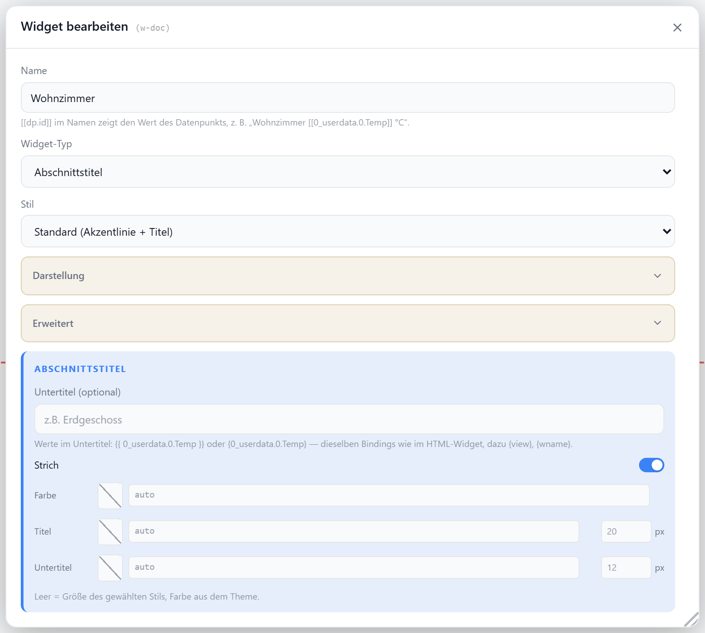

# Abschnittstitel

Überschrift mit Trennlinie zur optischen Gliederung des Dashboards — ohne Datenpunkt. Wahlweise mit Untertitel, Icon und farbigem Akzentbalken.

## Layouts

### Default
Großer Titel mit Akzentbalken und optionalem Untertitel — als Abschnittsüberschrift.

### Card
Wie Default, ohne eigenen Rahmenstil — für Karten-Hintergründe.

### Compact
Akzentbalken über die volle Höhe, Icon und Titel daneben — kompakte Zwischenüberschrift.

### Minimal
Icon und Kapitälchen-Titel mit durchgehender Trennlinie — dezente Gliederung.

### Framed
Wie Default, aber als vollwertige Widget-Karte mit Hintergrund, Rahmen, Radius und Innenabstand — für Abschnitte, die sich optisch in die Widget-Reihe einfügen sollen. Die Theme-Variablen `--header-text` und `--header-accent` wirken weiter; der Kartenhintergrund kommt vom Widget-Design, nicht von `--header-bg`.

## Einstellungen

Alle Optionen werden im Editor unter **Widget bearbeiten** gesetzt.

### Anzeige

| Option | Standard | |
| --- | --- | --- |
| `subtitle` | — | Untertitel (in allen Layouts) |
| `showTitle` | `true` | Titel anzeigen |
| `showSubtitle` | `true` | Untertitel anzeigen |
| `showIcon` | `true` | Icon anzeigen |
| `icon` | `Heading2` | [Lucide-Icon](https://lucide.dev) |
| `iconSize` | `20` | px |
| `titleAlign` | `left` | `left` · `center` · `right` (nur Default/Card; Akzentbalken nur bei `left`) |
